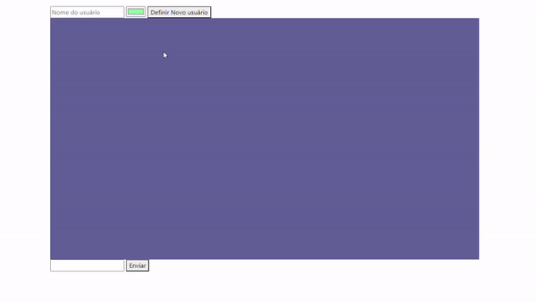

# Salas-de-Bate-Papo
A ferramenta apresenta dois grupos diferentes para o chat, estes que podem ser determinados como parâmetros do domínio(/grupo1 ou /grupo2). Cada usuário deve escolher um nome e cor antes de poder usar o chat. Techs: SocketIO,Express

